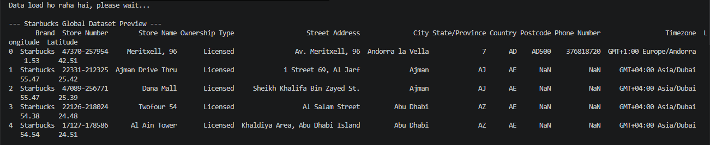
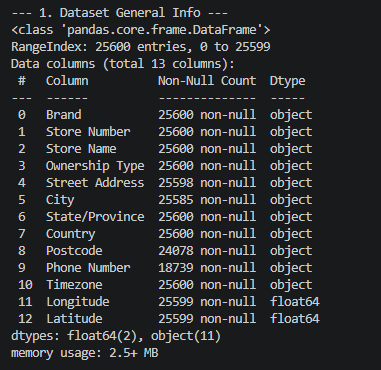
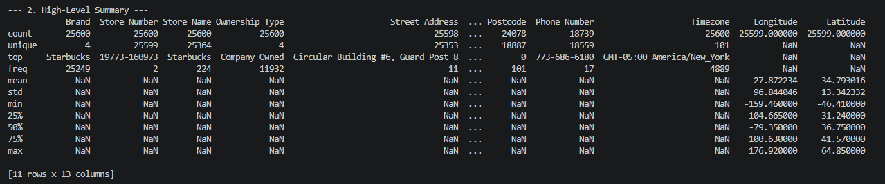
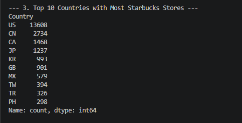
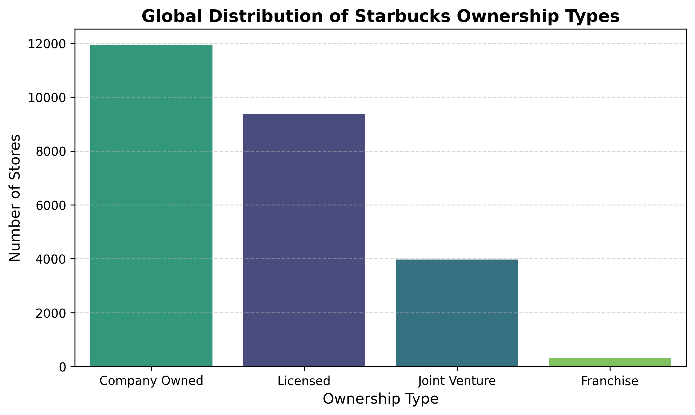
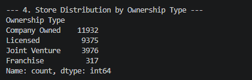
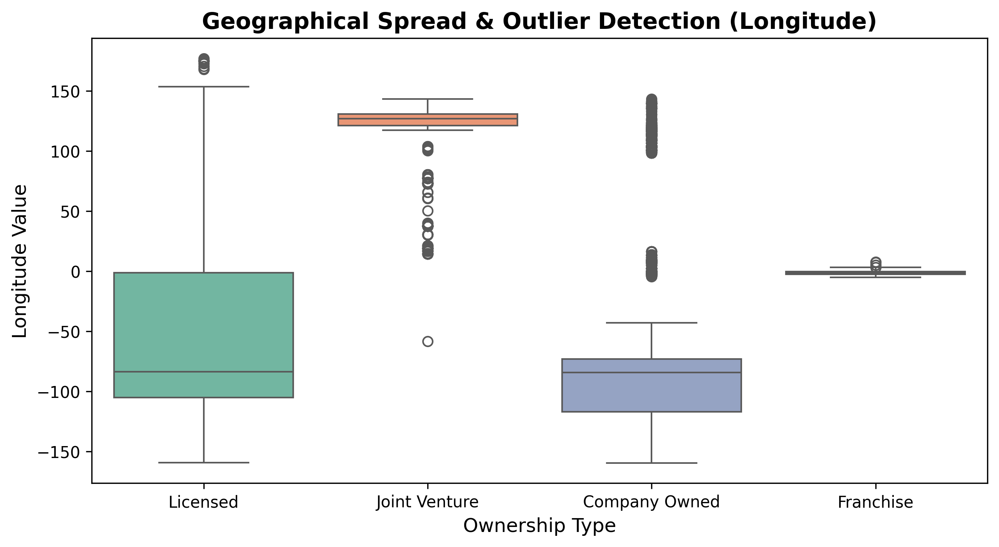
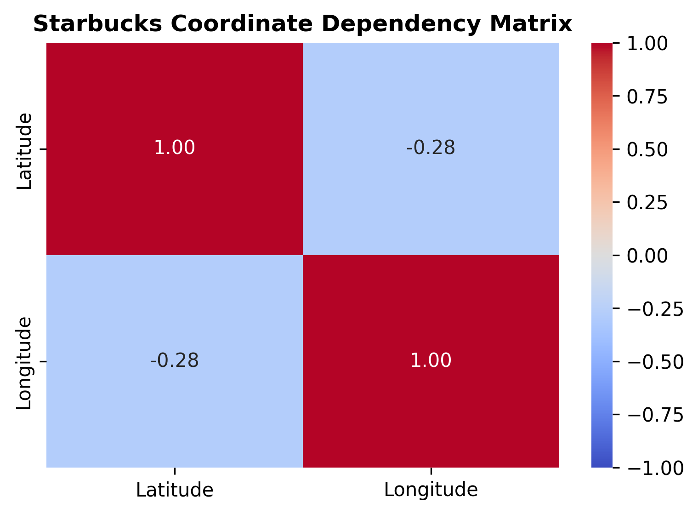
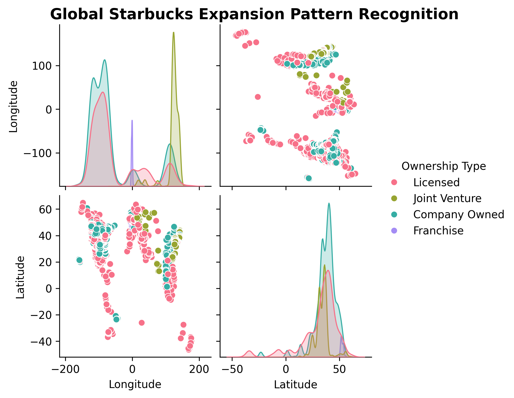

# Task-2 ☕ Global Starbucks Stores & Consumer Behavior (EDA)

## Project Objective
The goal of this project is to perform a comprehensive **Exploratory Data Analysis (EDA)** on the Starbucks Global Dataset to uncover hidden patterns, trends, operational structures, and geographical anomalies using advanced descriptive statistics and data visualization tools.

* **Domain:** Business Analytics & Spatial Data Analysis
* **Tools Used:** Python, Pandas, NumPy, Matplotlib, Seaborn

---

## 📂 Repository Structure
```text
├── starbucks_eda.py                   # Main Python analysis script
├── starbucks_store_locations.csv       # Source Dataset
├── Screenshots/                       # Subfolder containing runtime outputs
│   ├── 1.png                          # Dataset Preview
│   ├── 2.png                          # Dataset General Info
│   ├── 3.png                          # Statistical Summary Table
│   ├── 4.png                          # Top Countries List
│   ├── 5.png                          # Ownership Distribution Counts
│   ├── 1_ownership_distribution.png   # Bar Chart Output
│   ├── 2_geographical_spread_boxplot.png # Boxplot Output
│   ├── 3_coordinate_correlation_heatmap.png # Heatmap Output
│   └── 4_expansion_pattern_pairplot.jpg # Pairplot Output
└── README.md                          # Project Documentation (This file)
```

---

## ⚙️ Data Preprocessing & Summary Statistics

### 1. Dataset Preview
When loading the dataset, the first 5 records were printed to inspect the primary structure, verifying properties like store names, categories, and geocodes.

```python
df.head()
```


### 2. General Dataset Structure
Using structural metadata inspections, the dataset was confirmed to hold **25,600 unique store entries** across 13 unique information columns.

```python
df.info()
```


### 3. High-Level Summary Statistics
A comprehensive multi-variable summary table highlights boundaries, means, standard deviations, and quartile markers for numerical coordinates.

```python
df.describe(include='all')
```


### 4. Market Penetration Check (Top 10 Countries)
An aggregation breakdown isolates which sovereign regions handle the densest operational clusters.

```python
df['Country'].value_counts().head(10)
```

> **Key Metric:** The United States leadingly hosts **13,608 locations**, followed directly by China at **2,734 locations**.

---

## 📊 Visualizations & Business Inferences

### 1. Distribution of Ownership Models (Histogram/Countplot)
Tracks how ownership models differ across global corporate pipelines.



#### 🔍 Chart Breakdown:
* **Tallest Bar (Dark Blue/Purple):** Represents the most common ownership types globally (*Company Owned* and *Licensed*).
* **Shorter Bars (Green/Yellow):** Represent less frequent business models like *Joint Ventures* or *Franchises*.

> 💡 **Core Business Insight:** This visually proves exactly which business models Starbucks relies on for aggressive global scaling. **Company Owned** and **Licensed** models act as the core operational engines, while traditional franchising handles a minimal share.

* **Data Split Reference:**


---

### 2. Geographical Spread Analysis & Outlier Detection (Boxplot)
Maps numerical longitude fields grouped by operational business frameworks to detect anomalies.



#### 🔍 Chart Breakdown:
* **The Colored Boxes:** Represent the central data cluster where the middle 50% of Starbucks stores are located globally.
* **The Horizontal Center Line:** Marks the statistical median (average geographic placement) for that specific category.
* **The Black Dots:** Represent clear statistical **OUTLIERS**—extreme or isolated geographic coordinates.

> 💡 **Core Business Insight:** The box dimensions highlight that *Licensed* store placements are spread across a much wider geographic footprint compared to *Company Owned* setups. The outlying points flag unique, isolated international locations operating far away from standard dense corporate clusters.

---

### 3. Coordinate Dependency Matrix (Heatmap)
Evaluates linear relationships between spatial coordinates.



#### 🔍 Chart Breakdown:
* **Deep Red Blocks (+1.00):** Represent perfect positive linear correlation (variables matching perfectly with themselves).
* **Lighter Blue Blocks (-0.28):** Display the exact mathematical relationship between spatial variables.

> 💡 **Core Business Insight:** The mild negative correlation score of **-0.28** proves that a store's horizontal axis (Longitude) moves almost completely independently from its vertical axis (Latitude), indicating no strict linear or single-directional expansion pathway across the globe.

---

### 4. Regional Expansion Patterns (Pairplot)
Combines multi-variable scatter grids and internal smooth kernel density plots to track global overlaps.



#### 🔍 Chart Breakdown:
* **Diagonal Curves (Mountains):** Display the highest probability density areas for each distinct ownership style.
* **Scatter Grid Points:** Illustrate direct spatial overlapping where multiple store types operate in the same geographic zones.

> 💡 **Core Business Insight:** The density mountains help analysts easily spot the regional dominance of specific business frameworks, showing clear spatial partitions where certain strategies rule over others across different global hemispheres.
